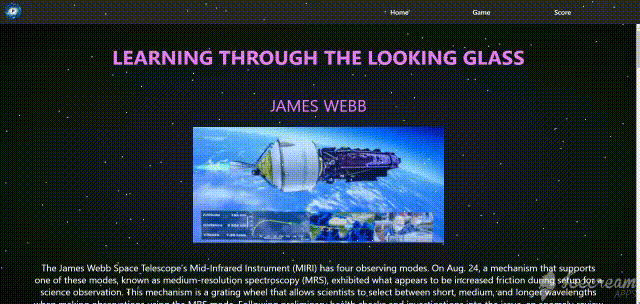

<h2 align="center">NASA Space Apps Challenge 2022 - Looking Glass</h2>

<hr/>

## ⚙️ Team Name: 
 
- Pentium

## ⚙️ Team Members: 
- [José Prieto](https://github.com/jackomo007)
- [Gremis Tovar](https://github.com/Gremis)

## ⚙️ Challenge: 
- Learning Through the Looking Glass

## ⚙️ What works:
- Summary of some space telescopes.
- Game that represents what the human eye would see when seeing astronomical phenomena.
- Trivia where an image is presented, provides a brief explanation of it and the user must find out which telescope took it.
- It is an application that works online and offline, based on PWA technology. For each correct answer the player accumulates points that are presented in a scoring section.

## ⚙️ How much can develop with more time in the future:
- Make configurations in the design to make it more responsive.
- A more advanced game could involve an app that simulates images using the NASA-provided WebbPSF tool.
- Other games of different difficulty level.

## ⚙️ Technologies Used:
- JavaScript
- Reactjs
- PWA
- Images from space agencies

## Instalação

## 🏁 To run the project:

Clone this repository on your machine:

```bash
$ git clone https://github.com/jackomo007/looking-glass
```

cd `looking-glass` and run:

```bash
npm install
```

```bash
npm start
```

<br/>

## Finally

The application can be installed on any device with internet access and works offline


For example, here we have the application running in the chrome browser:


Here the application is installed on a Windows system:


Here the application is installed on an android device:


The functioning of this application can be seen below:




